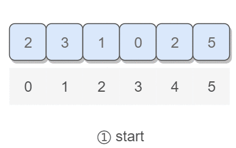

# 3. 数组中重复的数字

## 题目链接

[牛客网](https://www.nowcoder.com/practice/6fe361ede7e54db1b84adc81d09d8524?tpId=13)

## 题目描述

在一个长度为n的数组里的所有数字都在0到n-1的范围内。 数组中某些数字是重复的，但不知道有几个数字是重复的。也不知道每个数字重复几次。请找出数组中任意一个重复的数字。 例如，如果输入长度为7的数组[2,3,1,0,2,5,3]，那么对应的输出是2或者3。存在不合法的输入的话输出-1。

**数据范围**：0 ≤ n ≤ 10000
**进阶**：时间复杂度 O(n) ，空间复杂度 O(n)

```html
Input:
{2, 3, 1, 0, 2, 5}

Output:
2
```

## 解题思路

要求时间复杂度 O(N)，空间复杂度 O(1)。因此不能使用排序的方法，也不能使用额外的标记数组。

对于这种数组元素在 [0, n-1] 范围内的问题，可以将值为 i 的元素调整到第 i 个位置上进行求解。在调整过程中，如果第 i 位置上已经有一个值为 i 的元素，就可以知道 i 值重复。

以 (2, 3, 1, 0, 2, 5) 为例，遍历到位置 4 时，该位置上的数为 2，但是第 2 个位置上已经有一个 2 的值了，因此可以知道 2 重复：

<div align="center">  </div><br>

### 解题步骤

- step 1：遍历数组，遇到数组元素与下标相同的不用管。
- step 2：遇到数组元素与下标不同，就将其交换到属于它的位置，交换前检查那个位置是否有相同的元素，若有则重复。
- step 3：遍历结束完全交换也没重复，则返回-1.

### 示例代码

- Java/C++/Python示例代码

#### Java代码

```java
import java.util.*;
public class Solution {
    //交换函数
    private void swap(int[] numbers, int a, int b){
        int temp = numbers[a];
        numbers[a] = numbers[b];
        numbers[b] = temp;
    }
    public int duplicate (int[] numbers) {
        for(int i = 0; i < numbers.length; i++){
            //该位置本来就是对的
            if(numbers[i] == i)
                continue;
            //位置不对，需要换到自己对应的位置
            else{
                //对应位置相等，重复
                if(numbers[i] == numbers[numbers[i]])
                    return numbers[i];
                //交换位置
                else
                    swap(numbers, i, numbers[i]);
            }
        }
        //没有重复
        return -1;
    }
}

```

#### C++代码

```c++
class Solution {
public:
    int duplicate(vector<int>& numbers) {
        for(int i = 0; i < numbers.size(); i++){
            //该位置本来就是对的
            if(numbers[i] == i)
                continue;
            //位置不对，需要换到自己对应的位置
            else{
                //对应位置相等，重复
                if(numbers[i] == numbers[numbers[i]])
                    return numbers[i];
                //交换位置
                else
                    swap(numbers[i], numbers[numbers[i]]);
            }
        }
        //没有重复
        return -1;
    }
};

```

#### Python代码

```python
class Solution:
    #交换函数
    def swap(self, numbers: List[int], a: int, b: int):
        temp = numbers[a]
        numbers[a] = numbers[b]
        numbers[b] = temp
    
    def duplicate(self , numbers: List[int]) -> int:
        for i in range(len(numbers)):
            #该位置本来就是对的
            if numbers[i] == i:
                continue
            #位置不对，需要换到自己对应的位置
            else:
                #对应位置相等，重复
                if numbers[i] == numbers[numbers[i]]:
                    return numbers[i]
                #交换位置
                else:
                    self.swap(numbers, i, numbers[i])
        #没有重复
        return -1

```
