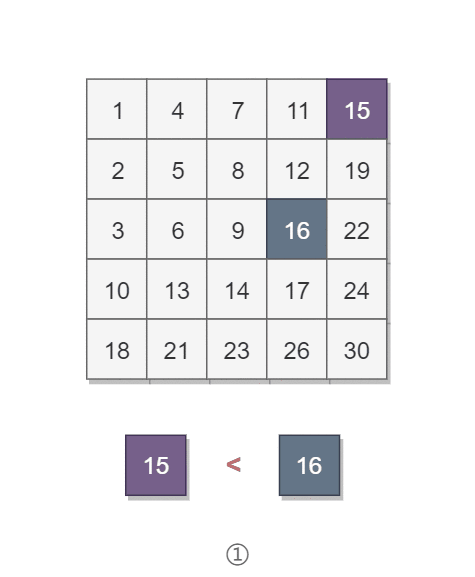

# 4. 二维数组中的查找

## 题目链接

[牛客网](https://www.nowcoder.com/practice/abc3fe2ce8e146608e868a70efebf62e?tpId=13)

## 题目描述

在一个二维数组array中（每个一维数组的长度相同），每一行都按照从左到右递增的顺序排序，每一列都按照从上到下递增的顺序排序。请完成一个函数，输入这样的一个二维数组和一个整数，判断数组中是否含有该整数。

**数据范围**：矩阵的长宽满足 0 ≤ n, m ≤ 500，矩阵中的值满足 0 ≤ val ≤ 10^9

**进阶**：空间复杂度 O(1)，时间复杂度 O(n+m)

```html
Consider the following matrix:
[
  [1,   4,  7, 11, 15],
  [2,   5,  8, 12, 19],
  [3,   6,  9, 16, 22],
  [10, 13, 14, 17, 24],
  [18, 21, 23, 26, 30]
]

Given target = 5, return true.
Given target = 20, return false.
```

## 解题思路

要求时间复杂度 O(M + N)，空间复杂度 O(1)。其中 M 为行数，N 为 列数。

该二维数组中的一个数，小于它的数一定在其左边，大于它的数一定在其下边。因此，从右上角开始查找，就可以根据 target 和当前元素的大小关系来快速地缩小查找区间，每次减少一行或者一列的元素。当前元素的查找区间为左下角的所有元素。

<div align="center">  </div><br>

### 解题步骤

- step 1：首先获取矩阵的两个边长，判断特殊情况。
- step 2：首先以右上角为起点，若是它小于目标元素，则往左移动去找小的，若是他大于目标元素，则往下移动去找大的。
- step 3：若是移动到了矩阵边界也没找到，说明矩阵中不存在目标值。

### 示例代码

- Java/C++/Python示例代码

#### Java代码

```java
public boolean Find(int target, int[][] matrix) {
    if (matrix == null || matrix.length == 0 || matrix[0].length == 0)
        return false;
    int rows = matrix.length, cols = matrix[0].length;
    int r = 0, c = cols - 1; // 从右上角开始
    while (r <= rows - 1 && c >= 0) {
        if (target == matrix[r][c])
            return true;
        else if (target > matrix[r][c])
            r++;
        else
            c--;
    }
    return false;
}
```

#### C++代码(从左下到右上)

```c++
class Solution {
public:
    bool Find(int target, vector<vector<int> > array) {
        //优先判断特殊
        if(array.size() == 0)  
            return false;
        int n = array.size();
        if(array[0].size() == 0)  
            return false;
        int m = array[0].size();
        //从最左下角的元素开始往左或往上
        for(int i = n - 1, j = 0; i >= 0 && j < m; ){ 
            //元素较大，往上走
            if(array[i][j] > target)   
                i--;
            //元素较小，往右走
            else if(array[i][j] < target) 
                j++;
            else
                return true;
        }
        return false;
    }
};

```

#### Python代码(从左下到右上)

```python
class Solution:
    def Find(self , target: int, array: List[List[int]]) -> bool:
        # 优先判断特殊
        if len(array) == 0: 
            return False
        n = len(array)
        if len(array[0]) == 0:
            return False
        m = len(array[0])
        i = n-1
        j = 0
        # 从最左下角的元素开始往左或往上
        while i >=0 and j < m: 
            # 元素较大，往上走
            if array[i][j] > target: 
                i -= 1
            # 元素较小，往右走
            elif array[i][j] < target: 
                j += 1
            else:
                return True
        return False

```
