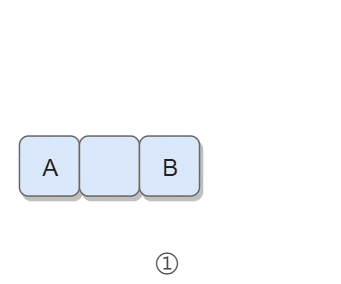

# 5. 替换空格

## 题目链接

[牛客网](https://www.nowcoder.com/practice/0e26e5551f2b489b9f58bc83aa4b6c68?tpId=13)

## 题目描述

请实现一个函数，将一个字符串s中的每个空格替换成"%20"。
例如，当字符串为 We Are Happy. 则经过替换之后的字符串为 We%20Are%20Happy.

数据范围: 0 ≤ len(s) ≤ 1000。保证字符串中的字符为大写英文字母、小写英文字母和空格中的一种。

```text
Input:
"A B"

Output:
"A%20B"
```

## 解题思路

① 在字符串尾部填充任意字符，使得字符串的长度等于替换之后的长度。因为一个空格要替换成三个字符（%20），所以当遍历到一个空格时，需要在尾部填充两个任意字符。

② 令 P1 指向字符串原来的末尾位置，P2 指向字符串现在的末尾位置。P1 和 P2 从后向前遍历，当 P1 遍历到一个空格时，就需要令 P2 指向的位置依次填充 02%（注意是逆序的），否则就填充上 P1 指向字符的值。从后向前遍是为了在改变 P2 所指向的内容时，不会影响到 P1 遍历原来字符串的内容。

③ 当 P2 遇到 P1 时（P2 \<= P1），或者遍历结束（P1 \< 0），退出。

<div align="center">  </div><br>

### 示例代码

- Java/C++/Python示例代码

#### Java代码

```java
public String replaceSpace(StringBuffer str) {
    int P1 = str.length() - 1;
    for (int i = 0; i <= P1; i++)
        if (str.charAt(i) == ' ')
            str.append("  ");

    int P2 = str.length() - 1;
    while (P1 >= 0 && P2 > P1) {
        char c = str.charAt(P1--);
        if (c == ' ') {
            str.setCharAt(P2--, '0');
            str.setCharAt(P2--, '2');
            str.setCharAt(P2--, '%');
        } else {
            str.setCharAt(P2--, c);
        }
    }
    return str.toString();
}
```

我们也可以用下标遍历字符串，每次检查下标所在位置的字符是否为空格，如果不是空格，下标继续往后，如果是空格则调用substr函数将字符串从空格前后截断，然后中间添加"%20"后相连即可。

#### C++代码

```c++
class Solution {
public:
    string replaceSpace(string s) {
        string res = "";
        //遍历字符串
        for(int i = 0; i < s.length(); i++){ 
            //非空格直接复制
            if(s[i] != ' ') 
                res += s[i];
            //空格就替换
            else 
                res += "%20"; 
        }
        return res;
    }
};

```

#### Python代码

```python
class Solution:
    def replaceSpace(self , s: str) -> str:
        res = ""
        #遍历字符串
        for i in s:
            #非空格直接复制
            if i != ' ': 
                res += i
            #空格就替换
            else:
                res += "%20" 
        return res

```