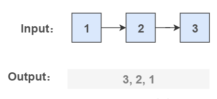
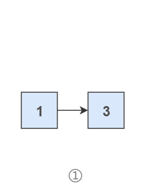
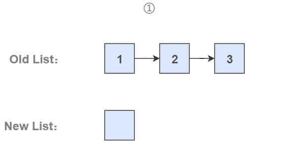
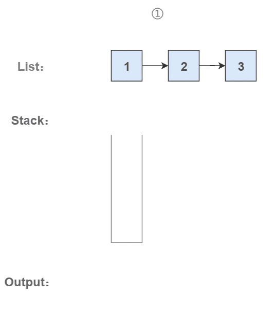

# 6. 从尾到头打印链表

## 题目链接

[牛客网](https://www.nowcoder.com/practice/d0267f7f55b3412ba93bd35cfa8e8035?tpId=13)

## 题目描述

输入一个链表的头节点，按链表从尾到头的顺序返回每个节点的值（用数组返回）。

如输入{1,2,3}的链表如下图:

<div align="center">  </div><br>

返回一个数组为[3,2,1]

0 <= 链表长度 <= 10000

```html
Input:
{67,0,24,58}

Output:
[58,24,0,67]
```

## 解题思路

### 1. 使用递归

要逆序打印链表 1-\>2-\>3（3,2,1)，可以先逆序打印链表 2-\>3(3,2)，最后再打印第一个节点 1。而链表 2-\>3 可以看成一个新的链表，要逆序打印该链表可以继续使用求解函数，也就是在求解函数中调用自己，这就是递归函数。

- Java实现

```java
public ArrayList<Integer> printListFromTailToHead(ListNode listNode) {
    ArrayList<Integer> ret = new ArrayList<>();
    if (listNode != null) {
        ret.addAll(printListFromTailToHead(listNode.next));
        ret.add(listNode.val);
    }
    return ret;
}
```

- C++实现

```c++
class Solution {
public:
    //递归函数
    void recursion(ListNode* head, vector<int>& res){ 
        if(head != NULL){
            //先往链表深处遍历
            recursion(head->next, res); 
            //再填充到数组就是逆序
            res.push_back(head->val); 
        }
    }
    vector<int> printListFromTailToHead(ListNode* head) {
        vector<int> res;
        //递归函数打印
        recursion(head, res); 
        return res;
    }
};

```

- Python实现

```python
import sys
#设置递归深度
sys.setrecursionlimit(100000) 
class Solution:
    def recursion(self, head: ListNode, res: List[int]):
        if head:
            #先往链表深处遍历
            self.recursion(head.next, res) 
            #再填充到数组就是逆序
            res.append(head.val) 
    def printListFromTailToHead(self , listNode: ListNode) -> List[int]:
        res = []
        #递归函数打印
        self.recursion(listNode, res) 
        return res

```

### 2. 使用头插法

头插法顾名思义是将节点插入到头部：在遍历原始链表时，将当前节点插入新链表的头部，使其成为第一个节点。

链表的操作需要维护后继关系，例如在某个节点 node1 之后插入一个节点 node2，我们可以通过修改后继关系来实现：

```java
node3 = node1.next;
node2.next = node3;
node1.next = node2;
```

<div align="center">  </div><br>


为了能将一个节点插入头部，我们引入了一个叫头结点的辅助节点，该节点不存储值，只是为了方便进行插入操作。不要将头结点与第一个节点混起来，第一个节点是链表中第一个真正存储值的节点。

<div align="center">  </div><br>

```java
public ArrayList<Integer> printListFromTailToHead(ListNode listNode) {
    // 头插法构建逆序链表
    ListNode head = new ListNode(-1);
    while (listNode != null) {
        ListNode memo = listNode.next;
        listNode.next = head.next;
        head.next = listNode;
        listNode = memo;
    }
    // 构建 ArrayList
    ArrayList<Integer> ret = new ArrayList<>();
    head = head.next;
    while (head != null) {
        ret.add(head.val);
        head = head.next;
    }
    return ret;
}
```

### 3. 使用栈

栈具有后进先出的特点，在遍历链表时将值按顺序放入栈中，最后出栈的顺序即为逆序。

<div align="center">  </div><br>

```java
public ArrayList<Integer> printListFromTailToHead(ListNode listNode) {
    Stack<Integer> stack = new Stack<>();
    while (listNode != null) {
        stack.add(listNode.val);
        listNode = listNode.next;
    }
    ArrayList<Integer> ret = new ArrayList<>();
    while (!stack.isEmpty())
        ret.add(stack.pop());
    return ret;
}
```
